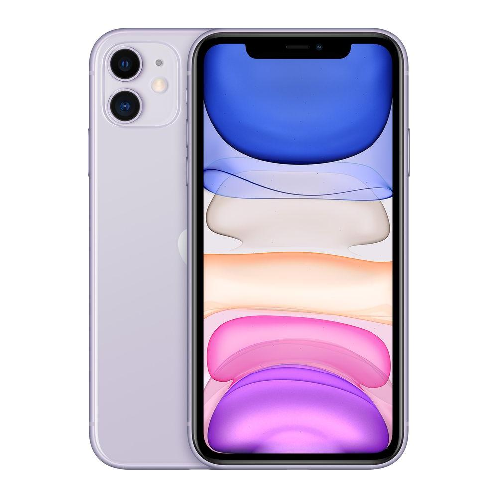

    <!DOCTYPE html>
<html lang="en">
<head>
  <title>cp</title>
  <meta charset="utf-8">
  <meta name="viewport" content="width=device-width, initial-scale=1">
  <link href="https://cdn.jsdelivr.net/npm/bootstrap@5.1.3/dist/css/bootstrap.min.css" rel="stylesheet">
  

  <link rel="stylesheet" href="https://maxcdn.bootstrapcdn.com/bootstrap/3.4.0/css/bootstrap.min.css">

  
</head>
<body>

<nav class="navbar navbar-expand-sm navbar-dark bg-danger">
  

    
    <button class="navbar-toggler" type="button" data-bs-toggle="collapse" data-bs-target="#mynavbar">
      
    </button>
    

      <ul class="navbar-nav me-auto">
        <li class="nav-item">
          <a class="nav-link" href="https://www.apple.com/in/mac/">MAC</a>
        </li>
        <li class="nav-item">
          <a class="nav-link" href="https://www.apple.com/in/iphone/">IPHONE</a>
        </li>
        <li class="nav-item">
          <a class="nav-link" href="https://support.apple.com/en-in">SUPPORT</a>
        </li>
      </ul>
      <form class="d-flex">
        <input class="form-control me-2" type="text" placeholder="Search">
        <button class="btn btn-warning" type="button">Search</button>
      </form>
    

  

</nav>

  <h><b>APPLE PRODUCTS</b></h>

  
  

  <ol class="carousel-indicators">
  <li data-target="#Carousel" data-slide-to="0" class="active"></li>
  <li data-target="#Carousel" data-slide-to="1"></li>
  <li data-target="#Carousel" data-slide-to="2"></li>
  </ol>
  

  

  
  

  <h3> Good Things </h3>
  
 Good things make us positive 

  

  

  

  
  

  <h3> Bad Thing </h3>
  
 Break a smile with a selfie

  

  

  

  
  

  <h3>Things for medium</h3>
  
We love the  our family much more..so make sure capture the moments

  

  

  

  <a class="left carousel-control" href="#Carousel" data-slide="prev">
  
  Previous
  </a>
  <a class="right carousel-control" href="#Carousel" data-slide="next">
  Next
  </a>
  

  

  <h3>SOME OF THE NEW COLLECTIONS!!!</h3>
  

    

      
  
  
<a href="https://www.jio.com/shop/buy-iphone-8">buy now</a>

  
    

    

      
      
<a href="https://www.apple.com/in/shop/buy-iphone/iphone-11">buy now</a>

    

    

      
 
<a href="https://www.apple.com/in/shop/buy-iphone/iphone-12">buy now</a>

 
    

    

       
      
<a href="https://www.apple.com/in/shop/buy-iphone/iphone-13"> buy now</a>
 
     
    

  

 

 
 

  <h2> VISIT US!!</h2>
  

<footer class="text-center text-lg-start bg-light text-muted">
  <!-- Section: Social media -->
  <section
    class="d-flex justify-content-center justify-content-lg-between p-4 border-bottom"
  >
    <!-- Left -->
    

      Get connected with us on social networks:
    

    <!-- Left -->

    <!-- Right -->
    

      

        
        
        
        

    

    <!-- Right -->
  </section>
  <!-- Section: Social media -->

  <!-- Section: Links  -->
  <section class="">
    

      <!-- Grid row -->
      

        <!-- Grid column -->
        

          <!-- Content -->
          <h6 class="text-uppercase fw-bold mb-4">
            <i class="fas fa-gem me-3"></i>About Apple
          </h6>
          
<i class="fas fa-phone me-3"></i> NewsRoom

          
<i class="fas fa-phone me-3"></i> Apple Leadership

          
<i class="fas fa-phone me-3"></i> job oppurtunities

          
<i class="fas fa-phone me-3"></i> investors

          
<i class="fas fa-phone me-3"></i> ethic and compliance

          
<i class="fas fa-phone me-3"></i> events

        

        <!-- Grid column -->

        <!-- Grid column -->
        

          <!-- Links -->
          <h6 class="text-uppercase fw-bold mb-4">
            Products
          </h6>
          

            <a href="#!" class="text-reset">Angular</a>
          

          

            <a href="#!" class="text-reset">React</a>
          

          

            <a href="#!" class="text-reset">Vue</a>
          

          

            <a href="#!" class="text-reset">Laravel</a>
          

        

        <!-- Grid column -->

        <!-- Grid column -->
        

          <!-- Links -->
          <h6 class="text-uppercase fw-bold mb-4">
            Apple Store
          </h6>
          

            <a href="#!" class="text-reset">shop online</a>
          

          

            <a href="#!" class="text-reset">ways to buy</a>
          

          

            <a href="#!" class="text-reset">apple trade in</a>
          

          

            <a href="#!" class="text-reset">order status</a>
          

        

        <!-- Grid column -->

        <!-- Grid column -->
        

          <!-- Links -->
          <h6 class="text-uppercase fw-bold mb-4">
            shop and learn
          </h6>
          
<i class="fas fa-home me-3"></i> iphone

          

            <i class="fas fa-envelope me-3"></i>
            ipad
          

          
<i class="fas fa-phone me-3"></i> mac

          
<i class="fas fa-print me-3"></i>tv&home

        

        <!-- Grid column -->
      

      <!-- Grid row -->
    

  </section>
  <!-- Section: Links  -->

  <!-- Copyright -->
  

    © 2021 Copyright:
    <a class="text-reset fw-bold" href="https://mdbootstrap.com/">Apple.com</a>
  

  <!-- Copyright -->
</footer>
<!-- Footer -->
</body>
</html>
