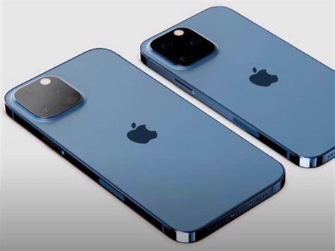

<!DOCTYPE html>
<html lang="en">
<head>
  <title>cp</title>
  <meta charset="utf-8">
  <meta name="viewport" content="width=device-width, initial-scale=1">
  <link href="https://cdn.jsdelivr.net/npm/bootstrap@5.1.3/dist/css/bootstrap.min.css" rel="stylesheet">
  
  
</head>
<body>

<nav class="navbar navbar-expand-sm navbar-dark bg-danger">
  

    
    <button class="navbar-toggler" type="button" data-bs-toggle="collapse" data-bs-target="#mynavbar">
      
    </button>
    

      <ul class="navbar-nav me-auto">
        <li class="nav-item">
          <a class="nav-link" href="https://www.apple.com/in/mac/">MAC</a>
        </li>
        <li class="nav-item">
          <a class="nav-link" href="https://www.apple.com/in/iphone/">IPHONE</a>
        </li>
        <li class="nav-item">
          <a class="nav-link" href="https://support.apple.com/en-in">SUPPORT</a>
        </li>
      </ul>
      <form class="d-flex">
        <input class="form-control me-2" type="text" placeholder="Search">
        <button class="btn btn-warning" type="button">Search</button>
      </form>
    

  

</nav>

  <h><b>APPLE PRODUCTS</b></h>

  

  <h3>SOME OF THE NEW COLLECTIONS!!!</h3>
  
  

  

  
 
   
  
BUY NOW
 

 
 

  <h2> VISIT US!!</h2>
  

    

      
      
      
      

  

</body>
</html>
